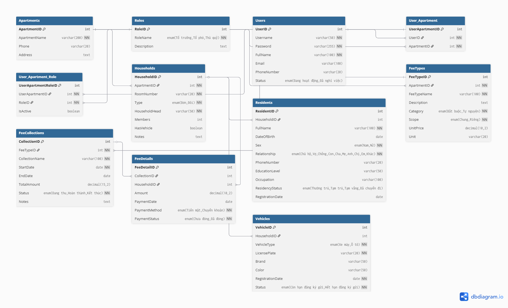

# GRADUATION RESEARCH 1
  Dự án triển khai kiến trúc multi - tenant vào phần mềm quản lý chung cư BlueMoon
## GIỚI THIỆU

 - Mô tả lại tính năng, đề bài được yêu cầu.
 - Ảnh chụp minh họa:\
   

## TÁC GIẢ

- Tên nhóm: Những anh chàng thư giãn
- Thành viên trong nhóm
  |STT|Họ tên|MSSV|
  |--:|--|--|
  |1|Tạ Hồng Phúc|20225906|
  |2|Bùi Quang Hưng|20225849|

## MÔI TRƯỜNG HOẠT ĐỘNG

- Mô tả sơ lược về các thành phần như máy tính, mobile, thiết bị IoT... các máy chủ back-end, front-end, mqtt, database
- Thông tin về nền tảng OS mà hệ thống vận hành
- Nên có sơ đồ tích hợp hệ thống để người xem thấy được mối liên quan giữa các thành phần.
  
## HƯỚNG DẪN CÀI ĐẶT VÀ CHẠY THỬ

  Các bước đề cài đặt hệ thống. Trường hợp với IoT, có thể hướng dẫn ngắn gọn là: cắm điện, gạt công tắc ....
  Nêu ra một tình huống sử dụng đơn giản để chứng tỏ sản phẩm có vận hành đúng (Self Test)

## NGUYÊN LÝ CƠ BẢN

> Tham khảo cách trình bày như ở đây [Code Project](https://www.codeproject.com/Articles/5385907/Managing-Cplusplus-Projects-with-Conan-and-CMake)

### TÍCH HỢP HỆ THỐNG

- Mô tả các thành phần phần cứng và vai trò của chúng: máy chủ, máy trạm, thiết bị IoT, MQTT Server, module cảm biến IoT...
- Mô tả các thành phần phần mềm và vai trò của chúng, vị trí nằm trên phần cứng nào: Front-end, Back-end, Worker, Middleware...

### CÁC THUẬT TOÁN CƠ BẢN

- Ví dụ: tạo token bằng JWT.
- Ví dụ: băm mật khẩu bằng MD5 theo công thức: MD5(key+"myapp"+key).
- Ví dụ: tạo id cho đối tượng bằng GUID, hoặc bằng hàm random.

### THIẾT KẾ CƠ SỞ DỮ LIỆU    999 

- Sơ đồ quan hệ thực thể để thể hiện mối quan hệ giữa các trường thông tin.

<div align="center">
  
  <br>
  <em>Hình: Sơ đồ quan hệ thực thể (ERD)</em>
</div>

- Giải thích các table, và một vài table.field quan trọng
  - **User**
    - Quản lý thông tin tài khoản người dùng, có thể thuộc nhiều tenant (căn hộ/chung cư).
    - Trường quan trọng:
      - `id`: Khóa chính
      - `username`: Tên đăng nhập
      - `password`: Mật khẩu (băm)
      - `email`: Email liên hệ

  - **Apartment**
    - Đại diện cho từng tenant (căn hộ/chung cư) trong hệ thống.
    - Trường quan trọng:
      - `id`: Khóa chính
      - `name`: Tên/mã căn hộ
      - `address`: Địa chỉ

  - **UserApartment**
    - Bảng liên kết nhiều-nhiều giữa User và Apartment, cho phép một user thuộc nhiều apartment (multi-tenant).
    - Trường quan trọng:
      - `id`: Khóa chính
      - `userId`: Liên kết User
      - `apartmentId`: Liên kết Apartment

  - **Role**
    - Danh sách các vai trò (admin, resident, guard, ...).
    - Trường quan trọng:
      - `id`: Khóa chính
      - `name`: Tên vai trò

  - **UserApartmentRole**
    - Gán vai trò cho user ở từng apartment, cho phép một user có vai trò khác nhau ở các tenant khác nhau.
    - Trường quan trọng:
      - `id`: Khóa chính
      - `userApartmentId`: Liên kết UserApartment
      - `roleId`: Liên kết Role

  - **Ví dụ luồng dữ liệu đa khách hàng:**
    - Một user có thể là tổ trưởng (admin) ở apartment A, nhưng chỉ là cư dân (resident) ở apartment B.
    - Khi đăng nhập, hệ thống xác định user đang thao tác với tenant (apartment) nào, và phân quyền dựa trên UserApartmentRole.

- Cấu trúc các file cấu hình như .env, .conf, .xml
- Cấu hình file .env
  ```env
  DB_HOST="Your database host"
  DB_USER="Your database user"
  DB_PASSWORD="Your database password"
  DB_NAME="Your database name"
  DB_PORT="Your database port"
  JWT_SECRET="Your JWT secret key"
  ```

### CÁC PAYLOAD   999 

- Cấu trúc các gói json

  **Ví dụ các payload trao đổi giữa các module/API:**

  - **Tạo căn hộ mới (Apartment):**
    ```json
    {
      "ApartmentName": "Chung cư A",
      "Phone": "02812345678",
      "Address": "123 Đường ABC, Quận 1, TP.HCM"
    }
    ```

  
  - **Gán vai trò cho user ở một căn hộ (User_Apartment_Role):**  
    ```json
    {
      "UserApartmentID": 2,
      "RoleID": 1,
      "IsActive": true
    }
    ```

### DEPENDENCES CHÍNH   999 

  **Backend:**
  ```
  - express
  - sequelize (ORM)
  - mysql2
  - jsonwebtoken (JWT)
  - bcrypt
  - cors
  - helmet
  - morgan
  - dotenv
  ```

  **Frontend:**
  ```
  - react
  - ant-design
  - react-router-dom
  - axios
  - recharts
  - react-icons
  ```

### ĐẶC TẢ HÀM

- Một số hàm quan trọng
- Mô tả ý nghĩa của hàm, tham số vào, ra
- Hoặc có thể tham chiếu, chụp ảnh từ các công cụ như swagger, pydoc, javadoc, doxygen

  ```C
     /**
      *  Hàm tính ...
      *  @param  x  Tham số
      *  @param  y  Tham số
      */
     void abc(int x, int y = 2);
  ```


### PHÁT SINH

_Các sự cố, vẫn đề, lỗi mà không xử lý được, hoặc xử lý mất quá 4h thì nên ghi vào đây, hoặc ghi vào [issue của GitHub](https://github.com/neittien0110/ProjectSample/issues). Sẽ được tính điểm. Ví dụ__

- __Lỗi: blablablabla__
  - Chi tiêt: .....
  - Nguyên nhân: ...
  - Giải pháp: chưa có

  
## KẾT QUẢ
Các ảnh chụp với caption giải thích.
Hoặc video sản phẩm

