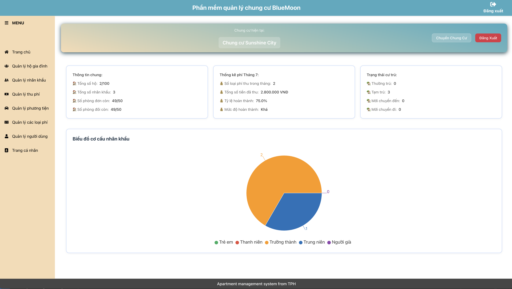

# GRADUATION RESEARCH 1
  Dự án triển khai kiến trúc multi - tenant vào phần mềm quản lý chung cư BlueMoon
## GIỚI THIỆU

Kiến trúc multi - tenant đang là xu hướng của các ứng dụng SaaS hiện nay. Qua ứng dụng này, ta sẽ tiến hành áp dụng kiến trúc này vào ứng dụng quản lý chung cư BlueMoon.
Ứng dụng BlueMoon là ứng dụng hỗ trợ quản lý chung cư với các chức năng:
-	Quản lý hộ dân cư
-	Quản lý nhân khẩu
-	Quản lý phương tiện
-	Quản lý thu phí
-	Quản lý loại phí (Dành cho Tổ trưởng)
-	Quản lý người dùng – Phân quyền người dùng (Dành cho Tổ trưởng)
-	Trang cá nhân

   
   <div align="center">
     <em>Hình: Sơ đồ tích hợp hệ thống</em>
    </div>


## TÁC GIẢ

- Tên nhóm: Những anh chàng thư giãn
- Thành viên trong nhóm
  |STT|Họ tên|MSSV|
  |--:|--|--|
  |1|Tạ Hồng Phúc|20225906|
  |2|Bùi Quang Hưng|20225849|

## MÔI TRƯỜNG HOẠT ĐỘNG

### 1. Thành phần hệ thống

#### Back-end

  Back-end đóng vai trò xử lý toàn bộ logic nghiệp vụ, bảo mật và quản lý dữ liệu. Kiến trúc phân tầng tại đây bao gồm các tầng chính như:
- Tầng Controller (Presentation Layer): Tiếp nhận yêu cầu từ client, điều 
phối luồng dữ liệu. 
- Tầng Service (Business Logic Layer): Xử lý nghiệp vụ cốt lõi, áp dụng các 
quy tắc của hệ thống. 
- Tầng Model (Data Access Layer): Giao tiếp với cơ sở dữ liệu, đảm bảo lưu 
trữ và truy xuất dữ liệu chính xác.

#### Front-end
  Front-end tập trung vào giao diện người dùng, tối ưu hóa trải nghiệm người dùng (UX) với thiết kế đơn giản, mượt mà và tương thích đa nền tảng. Phần này giao tiếp với server thông qua các API REST.

### 2. Nền tảng hệ điều hành hỗ trợ

- Windows 10/11, Linux, MacOS (chỉ cần cài đặt được Node.js và MySQL)

- Các trình duyệt web như Chrome, Safari, Cốc Cốc, ...
### 3. Sơ đồ tích hợp hệ thống

<div align="center">
  
  <br>
  <em>Hình: Sơ đồ tích hợp hệ thống</em>
</div>

  
## HƯỚNG DẪN CÀI ĐẶT VÀ CHẠY THỬ

### 1. Yêu Cầu Hệ Thống

- Node.js (phiên bản 18.0.0 trở lên)
- MySQL (phiên bản 8.0 trở lên)
- npm hoặc yarn

### 2. Cài Đặt Backend

1. Cài đặt các dependencies
   ```bash
   cd back-end
   npm install
   ```
2. Cấu hình môi trường

   - Tạo file `.env` trong thư mục back-end
   - Cấu hình các biến môi trường cần thiết

3. Khởi chạy server
   ```bash
   npm run dev
   ```

### 3. Cài Đặt Frontend

1. Cài đặt các dependencies

   ```bash
   cd front-end
   npm install
   ```

2. Khởi chạy ứng dụng
   ```bash
   npm run dev
   ```

### 4. Các Dependencies Chính

#### Backend

- Express.js
- Sequelize (ORM)
- MySQL2
- JWT (JSON Web Token)
- Bcrypt
- CORS
- Helmet
- Morgan
- Dotenv

#### Frontend

- React
- Ant Design
- React Router DOM
- Axios
- Recharts
- React Icons

### 5. Cấu Trúc Thư Mục

```
project_IT3180_nhom_10/
├── back-end/
│   ├── src/
│   ├── test/
│   └── index.js
└── front-end/
    ├── src/
    ├── public/
    └── index.html
```

### 6. Xử Lý Lỗi Thường Gặp

- Kiểm tra phiên bản Node.js
- Kiểm tra kết nối database
- Kiểm tra các biến môi trường
- Kiểm tra port đang sử dụng

## NGUYÊN LÝ CƠ BẢN

> Tham khảo cách trình bày như ở đây [Code Project](https://www.codeproject.com/Articles/5385907/Managing-Cplusplus-Projects-with-Conan-and-CMake)

### TÍCH HỢP HỆ THỐNG

- Mô tả các thành phần phần cứng và vai trò của chúng: máy chủ, máy trạm, thiết bị IoT, MQTT Server, module cảm biến IoT...
- Mô tả các thành phần phần mềm và vai trò của chúng, vị trí nằm trên phần cứng nào: Front-end, Back-end, Worker, Middleware...

## CÁC THUẬT TOÁN CƠ BẢN

### 1. Băm mật khẩu bằng Bcrypt khi tạo hoặc cập nhật user
   - Để đảm bảo an toàn, mật khẩu người dùng được băm trước khi lưu vào cơ sở dữ liệu.

     ```js
     const saltRounds = 10;
     const hashedPassword = await bcrypt.hash(Password, saltRounds);
     ```

### 2. So sánh mật khẩu khi đăng nhập
   - Khi người dùng đăng nhập, hệ thống sẽ so sánh mật khẩu nhập vào với mật khẩu đã băm trong database.

     ```js
     const isMatch = await bcrypt.compare(password, user.Password);
     if (!isMatch) return res.status(401).json({ message: "Invalid password" });
     ```

### 3. Sinh JWT Token khi đăng nhập thành công
   - Sau khi xác thực thành công, hệ thống sinh ra một JWT token để xác thực các request tiếp theo của người dùng.
   
     ```js
     const token = jwt.sign(
       { id: user.UserID },
       process.env.JWT_SECRET || "your_jwt_secret",
       { expiresIn: "1d" }
     );
     ```

### 4. Kiểm tra role động phía frontend (lấy role của user trong từng apartment)
   - Ứng dụng frontend gọi API để lấy vai trò hiện tại của user trong apartment đang chọn, lưu vào localStorage để điều hướng và hiển thị chức năng phù hợp.
   
     ```js
     const roleResponse = await axiosInstance.get(
       `/user-apartment-roles/get-roles-by-user-apartment/${currentUserApartment.UserApartmentID}`
     );
     const activeRole = roleResponse.data.roles.find(
       (role) => role.IsActive === true
     );
     if (activeRole && activeRole.Role) {
       localStorage.setItem("role", activeRole.Role.RoleName);
       return activeRole.Role.RoleName;
     }
     ```

## THIẾT KẾ CƠ SỞ DỮ LIỆU    999 

### 1. Sơ đồ logic để thể hiện mối quan hệ giữa các bảng trong CSDL.

<div align="center">
  
  <br>
  <em>Hình: Sơ đồ Logic</em>
</div>

### 2. Chi tiết các bảng phục vụ kiến trúc multi - tenant
  - **Users**
    - Quản lý thông tin tài khoản người dùng, có thể thuộc nhiều tenant (căn hộ/chung cư).
    - Trường quan trọng:
      - `UserID`: Khóa chính
      - `Username`: Tên đăng nhập
      - `Password`: Mật khẩu (băm)
      - `Email`: Email liên hệ

  - **Apartments**
    - Đại diện cho từng tenant (căn hộ/chung cư) trong hệ thống.
    - Trường quan trọng:
      - `ApartmentID`: Khóa chính
      - `ApartmentName`: Tên/mã căn hộ
      - `Address`: Địa chỉ

  - **User_Apartment**
    - Bảng liên kết nhiều-nhiều giữa User và Apartment, cho phép một user thuộc nhiều apartment (multi-tenant).
    - Trường quan trọng:
      - `UserApartmentID`: Khóa chính
      - `UserID`: Liên kết Users
      - `ApartmentID`: Liên kết Apartments

  - **Roles**
    - Danh sách các vai trò (tổ trưởng, thủ quỹ, tổ phó).
    - Trường quan trọng:
      - `RoleID`: Khóa chính
      - `RoleName`: Tên vai trò

  - **User_Apartment_Role**
    - Gán vai trò cho user ở từng apartment, cho phép một user có vai trò khác nhau ở các tenant khác nhau.
    - Trường quan trọng:
      - `UserApartmentRoleID`: Khóa chính
      - `UserApartmentID`: Liên kết UserApartment
      - `RoleID`: Liên kết Role

  - **Ví dụ luồng dữ liệu đa khách hàng:**
    - Một user có thể là tổ trưởng (admin) ở apartment A, nhưng chỉ là cư dân (resident) ở apartment B.
    - Khi đăng nhập, hệ thống xác định user đang thao tác với tenant (apartment) nào, và phân quyền dựa trên User_Apartment_Role.

### 3. Cấu hình file .env
  ```env
  DB_HOST="Your database host"
  DB_USER="Your database user"
  DB_PASSWORD="Your database password"
  DB_NAME="Your database name"
  DB_PORT="Your database port"
  JWT_SECRET="Your JWT secret key"
  ```

## CÁC PAYLOAD   999 

  ### Các payload JSON cho chức năng đa khách hàng:

  - **Tạo căn hộ mới (Apartment):**
    ```json
    {
      "ApartmentName": "Chung cư Sunshine",
      "Phone": "0123456789",
      "Address": "Số 1 Đại Cồ Việt, Bách Khoa, Hai Bà Trưng, Hà Nội"
    }
    ```

  - **Tạo user mới (User):**
    ```json
    {
      "Username": "admin",
      "Password": "123456",
      "FullName": "Nguyễn Văn A",
      "Email": "admin@gmail.com",
      "PhoneNumber": "0912345678"
    }
    ```

  - **Gán user vào một apartment (User_Apartment):**
    ```json
    {
      "UserID": 1,
      "ApartmentID": 1
    }
    ```

  - **Gán vai trò cho user ở một căn hộ (User_Apartment_Role):**  
    ```json
    {
      "UserApartmentID": 1,
      "RoleID": 1,      
      "IsActive": true
    }
    ```

## ĐẶC TẢ HÀM

- Một số hàm quan trọng
- Mô tả ý nghĩa của hàm, tham số vào, ra
- Hoặc có thể tham chiếu, chụp ảnh từ các công cụ như swagger, pydoc, javadoc, doxygen

  ```C
     /**
      *  Hàm tính ...
      *  @param  x  Tham số
      *  @param  y  Tham số
      */
     void abc(int x, int y = 2);
  ```


## PHÁT SINH

- __Lỗi: Cấp quyền khi tạo chung cư mới__
  - Chi tiết: Khi tạo chung cư mới, người dùng trong phiên hiện tại không thể truy cập các chức năng dành cho tổ trưởng mặc dù trong CSDL đã có bản ghi quyền Tổ trưởng với chung cư mới.
  - Nguyên nhân: Khi tạo chung cư mới, hệ thống đã tạo quyền truy cập cho người dùng trong CSDL nhưng chưa thêm vào localStorage, dẫn đến người dùng không truy cập được các chức năng admin
  - Giải pháp: Thêm role "Tổ trưởng" vào localStorage sau khi thêm role Tổ trưởng vào cơ sở dữ liệu

- __Lỗi: Không hiển thị role người dùng trong trang quản lý__
  - Chi tiết: Khi admin truy cập trang Account, một số quyền truy cập không thể xem được (không hiển thị)
  - Nguyên nhân: Trong form thêm role cho người dùng, thay vì đặt tên role là "Tổ phó", role được đặt nhầm thành "Phó tổ trưởng" dẫn đến không thể hiển thị role của người dùng
  - Giải pháp: Sửa tham số truyền vào khi chọn option "Tổ phó"

- __Lỗi: __
  - Chi tiết: 
  - Nguyên nhân: 
  - Giải pháp: 

  
## KẾT QUẢ
Các ảnh chụp với caption giải thích.
Hoặc video sản phẩm

